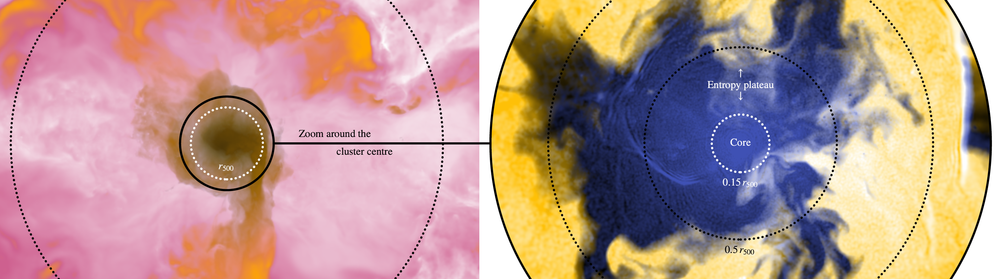

[](https://arxiv.org/abs/2505.05675)


# Entropy-core evolution

### Data and code associated with the [Altamura et al. (2025) paper](https://arxiv.org/abs/2505.05675)

*Entropy plateaus can emerge from gas replacement at a characteristic
halo mass in simulated groups and clusters of galaxies*

*Authors*: **Edoardo Altamura**, Scott T. Kay, Joop Schaye, Ian G. McCarthy, Matthieu Schaller

Documentation: [https://edoaltamura.github.io/entropy-core-evolution/](https://edoaltamura.github.io/entropy-core-evolution/)

## Table of Contents  
- [Overview](#overview)
- [Repository structure](#repository-structure)
- [Installation](#installation)
- [License](#license)
- [Acknowledgements](#acknowledgements)

## Overview  
This repository contains the data and analysis scripts useful to reproduce the 
results of Altamura et al. (2025, Paper II). Paper II investigates the emergence of entropy 
plateaus in simulated galaxy groups and clusters using cosmological hydrodynamic 
zoom-in simulations with the SWIFT-EAGLE model. It builds directly on the $z = 0$ 
entropy profile analysis presented in [Altamura et al. (2023, Paper I)](https://ui.adsabs.harvard.edu/abs/2023MNRAS.520.3164A/abstract). Visit 
[this repository](https://github.com/edoaltamura/entropy-core-problem) 
for data and scripts from Paper I.

<details>
  <summary>Summary of main science (click to expand)</summary>

- Entropy plateaus emerge at characteristic halo-mass scales. Simulations of a galaxy group
  $M_{500}\simeq8.8\times10^{12}$ $M_\odot$) and a cluster ($M_{500}\simeq2.9\times10^{14}$ $M_\odot$)
  show that once a halo reaches $M\sim10^{12}$ $M_\odot$, its entropy profile flattens at the 
  virial radius. As the halo grows to $\sim10^{13}$ $M_\odot$, the plateau extends inward, and by 
  $\sim10^{14}$ $M_\odot$ a fully isentropic core is established.

- AGN feedback is the principal mechanism.
Lagrangian tracking of gas particles reveals that AGN outbursts expel low-entropy gas before it can accrete into the core, replacing it with higher-entropy material and erasing the central gradient needed for a cool core.

- Transition coincides with peak SMBH activity.
The onset of the entropy plateau at $M\sim10^{12}$ $M_\odot$ aligns with the maximum in the 
  specific black-hole accretion rate, indicating a shift from supernova-dominated to AGN-dominated thermodynamic regulation.

- Numerical convergence.
High-resolution runs (gas particle mass $m_{\rm gas}\lesssim2.3\times10^5$ $M_\odot$) confirm 
  that the entropy plateau persists even when subgrid physics is resolved on smaller scales.

- Comparison with observations.
XMM–*Newton* studies of local groups report entropy excesses and flat cores consistent with the 
  predicted plateaus, while many clusters still exhibit steep, cool-core power laws. Reproducing the observed diversity of entropy profiles remains a challenge.

- Implications for AGN subgrid modeling.
The tendency to over-eject low-entropy gas suggests that current feedback prescriptions may be too aggressive at group scales. Adaptive efficiency schemes or hybrid thermal–kinetic models may be required to recover the full spectrum of entropy shapes without compromising other cluster properties.
</details>


#### Links to the paper and related contents
- ArXiv: [`https://arxiv.org/abs/2505.05675`](https://arxiv.org/abs/2505.05675)
- NASA ADS: [`https://ui.adsabs.harvard.edu/abs/2025arXiv250505675A/abstract`](https://ui.adsabs.harvard.edu/abs/2025arXiv250505675A/abstract)
- Google Scholar [`https://scholar.google.com/citations...isC`](https://scholar.google.com/citations?view_op=view_citation&hl=en&user=ThGKWoUAAAAJ&citation_for_view=ThGKWoUAAAAJ:5nxA0vEk-isC)

#### Citation
If you use this repository or its data in your work, please cite the relevant papers as 
described in the [CITATION.bib](./CITATION.bib) file with the `bibtex` handles.

> [!TIP]
>  You can generate `bibtex` handles or a text citation in your preferred style automatically 
> from NASA ADS's citation subpage ([`https://ui.adsabs.harvard.edu/abs/2025arXiv250505675A/exportcitation`](https://ui.adsabs.harvard.edu/abs/2025arXiv250505675A/exportcitation))

## Repository structure  
```text
├── data/               # Simulation data products
├── analysis_scripts/   # Analysis scripts to generate the data products
├── figures_scripts/    # Scripts to generate the figures from data products
└── img/                # Figures from the paper (pdf) and other visualisations
```

## Installation  
1. Clone this repository
```bash
git clone https://github.com/edoaltamura/entropy-core-evolution.git
cd entropy-core-evolution
```
2. Create and activate the environment

[//]: # (3. Use Python code snippets from the [examples]&#40;&#41; or [documentation]&#40;&#41; to load and plot the data.)


## License
This project is licensed under the Apache License Version 2.0.

## Acknowledgements
The authors thank Adrian Jenkins and Alastair Basden for high-performance computing support.
This work used the DiRAC@Durham facility managed by the Institute for Computational Cosmology on 
behalf of the STFC DiRAC HPC Facility ([https://dirac.ac.uk](www.dirac.ac.uk)). The equipment 
was funded by BEIS capital funding via STFC capital grants ST/K00042X/1, ST/P002293/1, ST/R002371/1 
and ST/S002502/1, Durham University, and STFC operations grant ST/R000832/1. DiRAC is part of the 
National e-Infrastructure. EA acknowledges the STFC studentship grant ST/T506291/1 and support from 
the Jodrell Bank Centre for Astrophysics at the University of Manchester.
