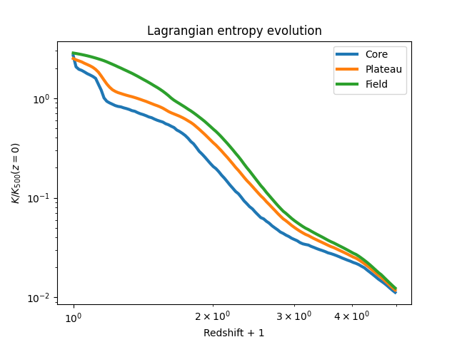

.. _lagrangian_histories:

Lagrangian histories
====================

In this example, we work with data from cosmological hydrodynamic simulations of a galaxy group.
Each NumPy ``.npy`` file contains the time evolution of a Lagrangian quantity — such as radius,
entropy, temperature, or density — for gas particles that, at redshift zero, lie in one of three
radial regions:

- Core: the innermost :math:`<0.15~r_{500}`.

- Shell: the shell between :math:`(0.15-1.00)~r_{500}`, where the entropy plateau is observed.

- Field: the region between :math:`(1-6)~r_{500}`, out to the high-resolution boundary of the
  zoom-in simulation.

These histories are stored as NumPy ``.npy`` files, with each file containing the time evolution of
a specific quantity for particles in one region.
Additionally, a ``redshift.npy`` array provides the redshift at each simulation snapshot, and a
``k500.npy`` file contains the entropy normalisation factor at :math:`z=0`.

Directory layout
----------------

Before we look at the code, make sure your project directory is organised like this:

.. code-block:: text

    data/
    └── VR2915_+1res_ref/
        ├── redshift.npy
        ├── k500.npy
        ├── gas_history_radius_Rcore_Thot_Oref.npy
        ├── gas_history_radius_Rshell_Thot_Oref.npy
        ├── gas_history_radius_Rfield_Thot_Oref.npy
        ├── gas_history_entropy_Rcore_Thot_Oref.npy
        ├── gas_history_entropy_Rshell_Thot_Oref.npy
        ├── gas_history_entropy_Rfield_Thot_Oref.npy
        └── (other files)

Each history file ends with the :math:`z=0` value, which we will use for normalisation.
The file name ``gas_history_radius_R{core}_T{hot}_O{ref}.npy`` contains the following information:

- ``R`` indicates the radial region, can be ``{core, shell, field}``.

- ``T`` indicates the temperature cut, can be ``{hot, cold}``.

- ``O`` indicates the sub-grid model used to select particles at :math:`z=0`, can be ``{ref, nr}``.

In this example, we are already looking at a Ref-model simulation, and the 'Origin' (``O``) is
also Ref, meaning we are selecting gas particles in Ref and tracking in Ref (red solid curves in
the paper). If you want to select gas particles in NR and track them in Ref, you will need to go
in the Ref data directory, and look for ``gas_history*Onr.npy`` files.

For the rest of this tutorial, we will consider the Ref-selected gas tracked in Ref.

Loading data
------------

We start by defining a helper function to load both the redshift array and any selected history
array. Note that an extra data point was accidentally appended to the ``data`` array, so we'll
remove that.

.. code-block:: python

   import numpy as np

    # Base directory where all runs are stored
    runs_location = "../data"

    def get_data(filename: str, run: str) -> tuple[np.ndarray, np.ndarray]:
        simulation_directory = f"{runs_location}/{run}"
        redshift = np.load(f"{simulation_directory}/redshift.npy")
        data = np.load(f"{simulation_directory}/{filename}.npy")[:-1]
        return redshift, data

Preparing the entropy data
--------------------------

We’ll now load the entropy histories for the core, shell, and field regions and normalize them by
the :math:`K_{500}(z=0)` value.

.. code-block:: python

    # Define a convenient shortcut for loading entropy histories
    get_data_group = lambda region: get_data(
        f"gas_history_entropy_R{region}_Thot_Oref",
        "VR2915_+1res_ref"
    )

    # Load entropy time series
    redshift, core = get_data_group("core")
    _, shell = get_data_group("shell")
    _, field = get_data_group("field")

    # Normalise by K500 at z = 0 (in keV cm^2)
    k500 = np.load("../data/VR2915_+1res_ref/k500.npy")[-1]

    core /= k500
    shell /= k500
    field /= k500

    # Apply a redshift cutoff to focus on z < 4
    z_mask = redshift < 4.0
    redshift = redshift[z_mask]
    core = core[z_mask]
    shell = shell[z_mask]
    field = field[z_mask]

Plotting the evolution
----------------------

Finally, we plot the normalised entropy evolution for all three regions, using a log-log scale
for clarity.

.. code-block:: python

   import matplotlib.pyplot as plt

    plt.figure()
    plt.loglog(redshift + 1, core, lw=3, label="Core")
    plt.loglog(redshift + 1, shell, lw=3, label="Plateau")
    plt.loglog(redshift + 1, field, lw=3, label="Field")
    plt.xlabel("Redshift + 1")
    plt.ylabel(r"$K / K_{500}(z=0)$")
    plt.legend()
    plt.title("Lagrangian Entropy Evolution")

    plt.savefig("lagrangian_histories.png")

This script will generate and save a figure named ``lagrangian_histories.png``, showing how the
entropy evolves over time in the core, shell, and field of the galaxy group. The plot should look
like this:

You can also find a script with the snippets above merged together in the ``test`` directory of
the GitHub repository.