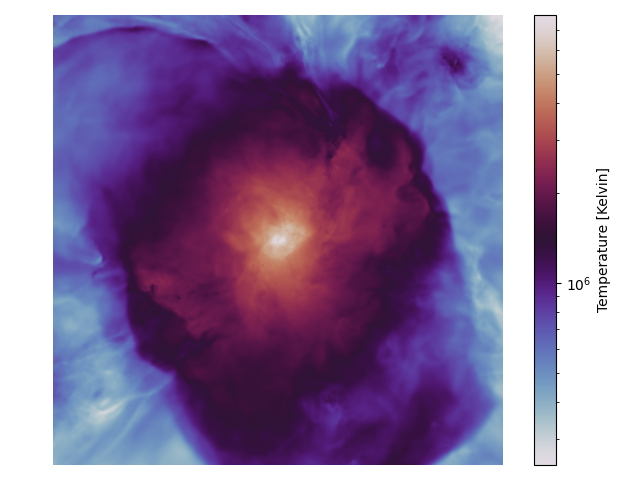
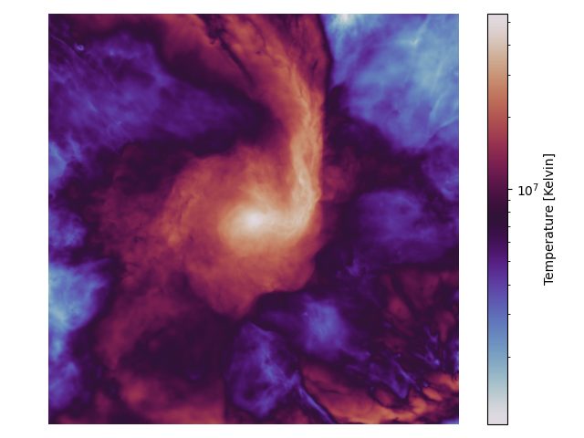

.. _projected_maps:

Projected maps
==============

In this tutorial, we will guide you through how to reproduce the projected maps of a galaxy group
and cluster, as featured in Fig. 2 of the *entropy plateaus* paper.
These maps visually capture key physical properties of the simulated systems, such as:

- Hot-to-cold gas mass ratio
- Emission-weighted temperatures
- Mass-weighted entropies

By the end of this walkthrough, you will be able to generate your own visualizations directly
from the simulation data.

Overview of the data
--------------------

The maps are built from high-resolution simulation outputs stored in HDF5 format.
These files contain precomputed quantities for both the group and cluster simulations.

To locate the data, navigate to:

.. code-block:: bash

    $ cd <root directory>/entropy-core-evolution/data/fig2_maps

You will find two key files:

.. code-block:: bash

    $ ls
    cluster_+1res_maps.hdf5 group_+8res_maps.hdf5

You can explore the contents using the ``h5dump`` command:

.. code-block:: bash

    $ h5dump -n cluster_+1res_maps.hdf5
    HDF5 "cluster_+1res_maps.hdf5" {
    FILE_CONTENTS {
     group      /
     dataset    /center
     dataset    /entropies_mass_hightemp
     dataset    /entropies_mass_lowtemp
     dataset    /m500
     dataset    /masses_hightemp
     dataset    /masses_lowtemp
     dataset    /r500
     dataset    /redshift
     dataset    /roi
     dataset    /snapshot_index
     dataset    /temperature_mass_hightemp
     dataset    /temperature_mass_lowtemp
     }
    }

These datasets cover various physical properties across different phases and temperature ranges.

Loading the data in memory
--------------------------

Let’s start by loading the contents of these HDF5 files into Python so we can work with them.
We will create a utility function that reads the data into a convenient Python dictionary.

.. code-block:: python

    import h5py
    import numpy as np

    def load_hdf5_to_dict(filepath):

        data_dict = {}

        with h5py.File(filepath, 'r') as f:
            for key in f.keys():
                data = f[key][()]

                # Automatically convert to numpy array if needed
                if isinstance(data, np.ndarray):
                    data_dict[key] = data
                else:
                    data_dict[key] = np.array(data)

        return data_dict

Now, call this function to load the group and cluster data:

.. code-block:: python

    group_data = load_hdf5_to_dict("group_+8res_maps.hdf5")
    cluster_data = load_hdf5_to_dict("cluster_+1res_maps.hdf5")

Example: mass-weighted temperature
----------------------------------

As a concrete example, let’s visualize the mass-weighted temperature of the group at :math:`z=0`

.. code-block:: python

    import matplotlib.pyplot as plt
    from matplotlib.colors import LogNorm

    phase_idx = -1
    mass_weighted_temperatures = group_data["temperature_mass_hightemp"][phase_idx] # Units: K Msun
    masses = group_data["masses_hightemp"][phase_idx] * 1e10 # Units: Msun (originally saved in SWIFT units)

    plt.axis("off")
    plt.imshow(mass_weighted_temperatures / masses, norm=LogNorm(), cmap='twilight')
    plt.colorbar(label="Temperature [Kelvin]")
    plt.tight_layout()
    plt.savefig("map_group.png")
    plt.close()

The resulting plot will look like this:

To generate the corresponding map for the cluster, follow the same procedure using the
``cluster_data`` dictionary:

You can also find a script with the snippets above merged together in the ``test`` directory of
the GitHub repository.